# Ignis

[](https://github.com/Nathan-W123/Ignis/actions/workflows/ci.yml)
[](LICENSE)


**A thermochemical liquid-rocket propulsion simulator in C++17.**

Ignis computes what a liquid rocket engine does, from the propellants up:
equilibrium combustion composition and flame temperature by constrained Gibbs
minimisation, quasi-1D nozzle expansion with shifting or frozen chemistry,
thrust and specific impulse at any altitude, regenerative-cooling heat transfer
and wall temperatures, chamber start-up and shutdown transients, constrained
design optimisation, and Monte Carlo uncertainty propagation with sensitivity
ranking.

It is validated against **NASA CEA** and **Cantera**, agrees with CEA to
**0.18 % or better** on flame temperature and **0.06 % or better** on
characteristic velocity across 156 rocket cases, and reports the residual of
every balance it claims to close.

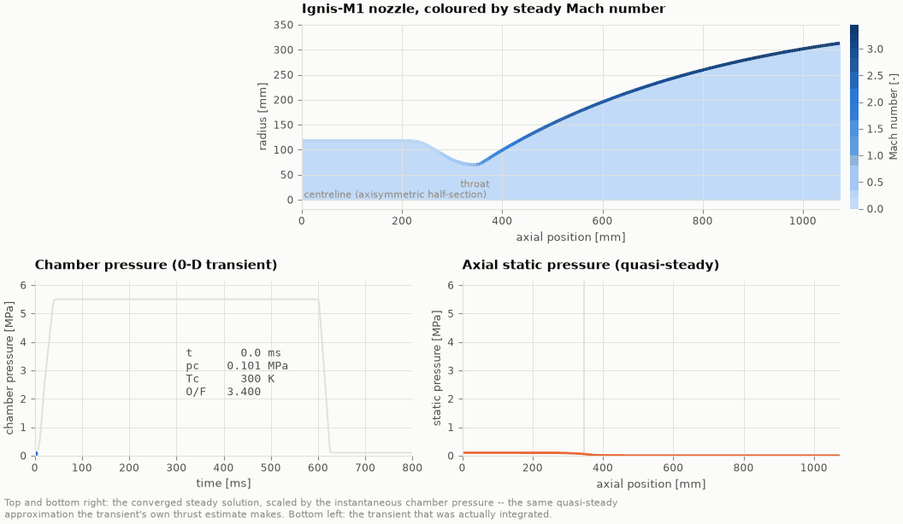

*The Ignis-M1 chamber pressure building through ignition, integrated with a
zero-dimensional mass and energy balance closed by a tabulated equilibrium
equation of state. The nozzle panel is the converged steady solution — see
[what that means](docs/limitations.md#5-transient).*

---

## Contents

| | |
|---|---|
| [What it does](#what-it-does) | The physics, module by module |
| [Quick start](#quick-start) | Build and run in three commands |
| [Results](#results) | Actual measured output |
| [Validation](#validation) | Against NASA CEA and Cantera |
| [Performance](#performance) | Measured benchmarks |
| [Architecture](#architecture) | How the code is laid out |
| [Documentation](#documentation) | The full set |
| [Limitations](#limitations) | What this is *not* |

---

## What it does

**Thermochemistry.** 40 species from NASA TM-4513 7-coefficient polynomials.
Chemical equilibrium by constrained Gibbs-energy minimisation in the
Gordon–McBride descent formulation, solved in (ln n<sub>j</sub>, ln n,
π<sub>i</sub>, ln T). The per-species unknowns are eliminated analytically, so
the Newton system is (E+1)×(E+1) at fixed temperature and (E+2)×(E+2) when the
temperature is unknown — **4×4 or 5×5 for a C/H/O system, regardless of how
many species are carried**. Constant-(T,p), constant-(h,p), constant-(s,p) and
constant-(u,v) problems, plus the full equilibrium derivative set
(c<sub>p,eff</sub>, ∂lnV/∂lnT, ∂lnV/∂lnp, γ<sub>s</sub>, sound speed).

**Combustion.** Propellants carry their *absolute* enthalpy in their delivered
state — liquid oxygen at 90.18 K, liquid methane at 111.66 K — so the chamber
solve is a genuine constant-enthalpy problem from the tank, not from gaseous
reactants at 298.15 K.

**Nozzle.** Rao-type bell contours from six analytic C¹ segments, or conical.
Quasi-1D marching on static pressure with shifting-equilibrium or frozen
chemistry; the throat located by M(p) = 1; area ratios by Illinois regula
falsi. Variable-property equilibrium-gas normal shocks (ideal thermal EOS,
state-dependent c<sub>p</sub>, γ and molar mass — not a non-ideal
compressibility model), expansion-regime classification, and the Summerfield
and Schmucker separation criteria. U.S. Standard Atmosphere 1976 with the
standard's own constants.

**Thermal.** Chapman–Enskog transport with Neufeld collision integrals, the
Brokaw polar correction, modified Eucken and Wilke mixing. Bartz hot-gas
coefficient, recovery temperature, cylindrical wall conduction, optional
gray-gas radiation. Regenerative cooling as a coupled hot-gas/wall/coolant
balance with rectangular-fin efficiency, an enthalpy-based coolant march,
Colebrook friction and reference-EOS coolant properties (Setzmann & Wagner,
Leachman *et al.*, Schmidt & Wagner).

**Transient.** A zero-dimensional chamber tracking oxidiser and fuel mass
separately, closed by a pre-tabulated equilibrium equation of state with
tensor-product cubic-Hermite interpolation (measured error ≤ 0.13 %).
Fixed-step RK4 and adaptive Cash–Karp RK4(5). Mass and energy conservation
integrals reported on every run.

**Studies.** N-dimensional sweeps; constrained optimisation by augmented
Lagrangian around a dimension-adaptive Nelder–Mead simplex with Latin-hypercube
multi-start; Monte Carlo with per-sample `SplitMix64` seeding, so results are
**byte-identical regardless of thread count**, plus standardised regression
coefficients, Spearman rank correlations and local elasticities.

---

## Quick start

Needs a C++17 compiler, CMake ≥ 3.16, and Python 3 with NumPy, pandas and
Matplotlib for the figures. Eigen, yaml-cpp and Catch2 are used if installed
and fetched automatically if not.

```bash
git clone https://github.com/Nathan-W123/Ignis.git && cd Ignis
./scripts/build.sh                 # configure + build, ~36 s on 4 cores
./scripts/test.sh                  # 78 test cases, ~1 min on 4 cores
```

Run the nominal LOX/methane engine:

```bash
./build/bin/ignis_engine --config configs/methane_nominal.yaml
```

Reproduce **everything** in this README — every case, sweep, transient,
optimisation, Monte Carlo campaign, benchmark and figure:

```bash
pip install -r python/requirements.txt
./scripts/run_all.sh               # 14 min from a fresh clone; --quick for 6
```

It prints its own end-to-end wall time at the end, and it fails loudly on the
first error.

### The desktop Explorer

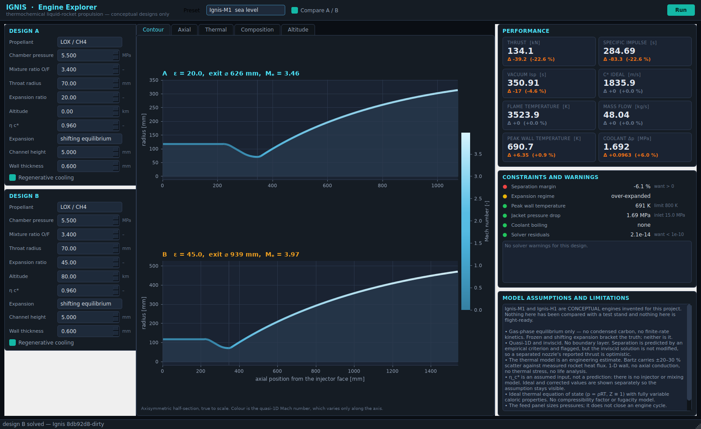

```bash
pip install -r python/requirements-explorer.txt
python3 explorer.py
```

**Ignis Engine Explorer** puts the solver behind an interactive dashboard:
change a chamber pressure, mixture ratio, expansion ratio or altitude and see
the performance, the flow field and the thermal consequence, with a second
design slot for side-by-side comparison. It implements no physics of its own —
it writes a configuration, runs the same binaries listed below, and shows what
they returned, including the refusal when a design does not close. The model's
limitations are pinned open next to the answer rather than hidden behind a
menu. See [`docs/explorer.md`](docs/explorer.md).

### The six tools

| Tool | What it does |
|---|---|
| `ignis_equilibrium` | Equilibrium composition, properties and residuals; `--mr-sweep MIN:MAX:N` for composition against mixture ratio |
| `ignis_engine` | One complete steady analysis: chamber, nozzle, performance, cooling, feed system |
| `ignis_nozzle` | Nozzle performance across altitude or ambient pressure, with regime classification |
| `ignis_transient` | Start-up / shutdown integration with conservation residuals |
| `ignis_sweep` | Full-factorial sweeps and constrained optimisation (`--mode optimize`) |
| `ignis_mc` | Deterministic multithreaded Monte Carlo with sensitivity ranking |

All six take `--config`, `-o/--output`, `--prefix`, `--set KEY=VALUE`,
`--help`, `--version`, and return a non-zero exit status on any failure.

---

## Results

Two conceptual engines are carried through the whole repository. **They are
invented for this project and are not models of any real hardware.**

### Ignis-M1 — LOX/methane booster, sea-level nozzle

`configs/methane_nominal.yaml` · p<sub>c</sub> 5.5 MPa · O/F 3.4 · R<sub>t</sub>
70 mm · ε 20 · η<sub>c\*</sub> 0.96 · 300 CuCrZr channels, full fuel flow

| | |
|---|---:|
| Flame temperature | **3523.92 K** |
| Mean molar mass | 21.6169 g/mol |
| γ<sub>s</sub> (isentropic) | 1.12968 |
| Characteristic velocity, ideal / corrected | 1835.93 / 1762.49 m/s |
| Mass flow | 48.0377 kg/s |
| Exit Mach / pressure | 3.4595 / 34.38 kPa |
| Thrust at sea level | **134.1 kN** |
| I<sub>sp</sub> at sea level | **284.69 s** |
| I<sub>sp</sub> in vacuum | 350.91 s |
| Thrust coefficient, ideal / corrected | 1.5930 / 1.5840 |
| Peak heat flux | **49.67 MW/m²** at x = 346.8 mm |
| Peak hot-wall temperature | **797.7 K** at x = 333.4 mm |
| Coolant rise / pressure drop | 111.66 → 493.29 K / 3.33 MPa |
| Tank pressures (ox / fuel) | 6.636 / 6.641 MPa |

The nozzle is over-expanded at sea level — the pressure term is **−20.6 kN** —
and separation is predicted at A/A<sub>t</sub> = 17.6. Ignis says so; it does
not quietly report the attached-flow number as if it were the whole story.

### Ignis-H1 — LOX/hydrogen upper stage

`configs/hydrogen_nominal.yaml` · p<sub>c</sub> 5.5 MPa · O/F 5.5 ·
R<sub>t</sub> 60 mm · ε 60 · η<sub>c\*</sub> 0.97

| | |
|---|---:|
| Flame temperature | **3382.77 K** |
| Mean molar mass | 12.6428 g/mol |
| Characteristic velocity, ideal | 2337.60 m/s |
| Mass flow | 27.4330 kg/s |
| Vacuum thrust | **123.5 kN** |
| Vacuum I<sub>sp</sub> | **459.05 s** |
| Peak heat flux / wall temperature | 71.86 MW/m² / **666.9 K** |
| Coolant rise / pressure drop | 25.0 → 248.63 K / 1.84 MPa |

Half the molar mass buys 108 s of vacuum impulse over the methane engine
(459.05 s at ε = 60 against 350.91 s at ε = 20 — a comparison of the two
*designs*, not of the propellants at matched geometry). Hydrogen drives 1.45×
the peak heat flux, and its heat capacity still holds the wall 131 K cooler.

### Frozen against shifting equilibrium

LOX/CH<sub>4</sub> at p<sub>c</sub> = 5.5 MPa, O/F 3.4, ε = 45: shifting
**370.41 s** against frozen **343.56 s** — recombination in the nozzle is worth
**7.82 %** of vacuum impulse. Both are computed; neither is presented as *the*
answer.

### Constrained ascent trade study

Maximising vacuum I<sub>sp</sub> under thermal limits alone is not a trade:
vacuum I<sub>sp</sub> rises monotonically with expansion ratio, so the
optimiser walks ε to whatever bound it is given and the answer *is* the bound.
A booster delivers its impulse across a trajectory, and a first stage spends
most of its burn low, where an over-expanded nozzle loses thrust and eventually
separates. The shipped study therefore maximises the **time-weighted ascent
specific impulse** under the constraints that actually size a booster:

| | Baseline | Optimised | |
|---|---:|---:|---|
| **Ascent I<sub>sp</sub>** (objective) | 318.19 s | **336.29 s** | +5.7 % |
| Chamber pressure | 5.50 MPa | 10.75 MPa | |
| Mixture ratio | 3.40 | 3.412 | |
| Expansion ratio | 20.0 | **25.67** | interior to [6, 40] |
| Throat radius | 70.0 mm | 50.4 mm | |
| Sea-level thrust | 134.1 kN | 149.2 kN | ✓ 130–150 kN class (**active**) |
| Peak wall temperature | 690.7 K | 794.3 K | ✓ ≤ 800 K (**active**) |
| Jacket pressure drop | 1.69 MPa | 3.84 MPa | ✓ ≤ 4.0 MPa (**active**) |
| Separation margin at lift-off | −6.1 % | +7.2 % | ✓ ≥ +2 % |
| Exit diameter | 626 mm | 511 mm | ✓ ≤ 700 mm |
| Engine length | 1074 mm | 925 mm | ✓ ≤ 1300 mm |

The story the numbers tell: held to a 130–150 kN sea-level thrust class, the
optimiser raises chamber pressure until the **liner** and the **jacket** run
out of margin, shrinks the throat to stay under the thrust ceiling, and settles
the expansion ratio at 25.7 — where the flow still runs full at lift-off and
the ascent-averaged impulse peaks. Three constraints from three different
disciplines end active, and the expansion ratio lands well inside its bounds.

An ε scan at fixed pressure shows why the objective matters: ascent
I<sub>sp</sub> peaks near ε = 15 and the separation margin goes negative by
ε = 20, while vacuum I<sub>sp</sub> is still climbing at ε = 90.

It is a local method with Latin-hypercube multi-start, not a global proof, and
12 starts are needed to find a feasible set this narrow — see
[limitations](docs/limitations.md#6-optimisation-and-uncertainty).

### Monte Carlo — 2000 samples, 10 dispersed inputs

58.2 s at 34.4 samples/s on 4 threads, 0 failures:

| Output | mean | p5 | p95 | σ/mean |
|---|---:|---:|---:|---:|
| Thrust | 134.69 kN | 128.34 | 140.82 | 2.8 % |
| I<sub>sp</sub> (sea level) | 284.77 s | 282.23 | 287.14 | 0.5 % |
| I<sub>sp</sub> (vacuum) | 350.78 s | 350.11 | 351.33 | 0.1 % |
| Flame temperature | 3523.4 K | 3514.0 | 3531.6 | 0.15 % |
| **Peak wall temperature** | **799.4 K** | 664.2 | **945.3** | **10.7 %** |
| Peak heat flux | 50.0 MW/m² | 41.8 | 59.2 | 10.7 % |
| Jacket pressure drop | 3.40 MPa | 2.44 | 4.55 | 19.4 % |

**The headline result is the asymmetry.** Performance is tight — vacuum
I<sub>sp</sub> varies by 0.1 % — while the thermal answer is not: **973 of 2000
samples exceed the wall-temperature limit**, and the single dominant cause is
the Bartz correlation itself (SRC **0.994**, Spearman 0.992), not any
manufacturing tolerance. That is the honest state of a conceptual regeneratively
cooled engine: the performance is known, the cooling margin is a correlation
away from being unknown.

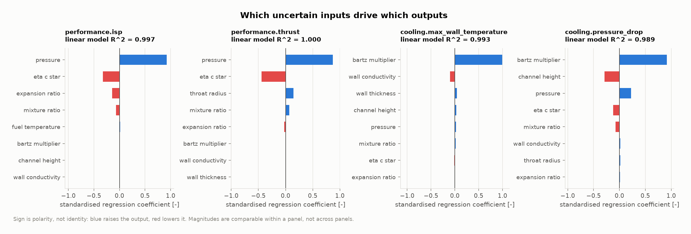

### More figures

| | |
|---|---|
| 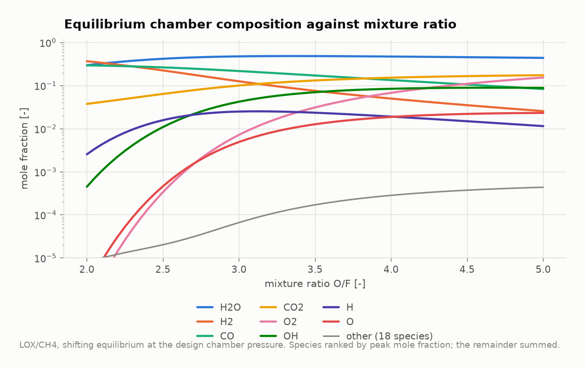 | 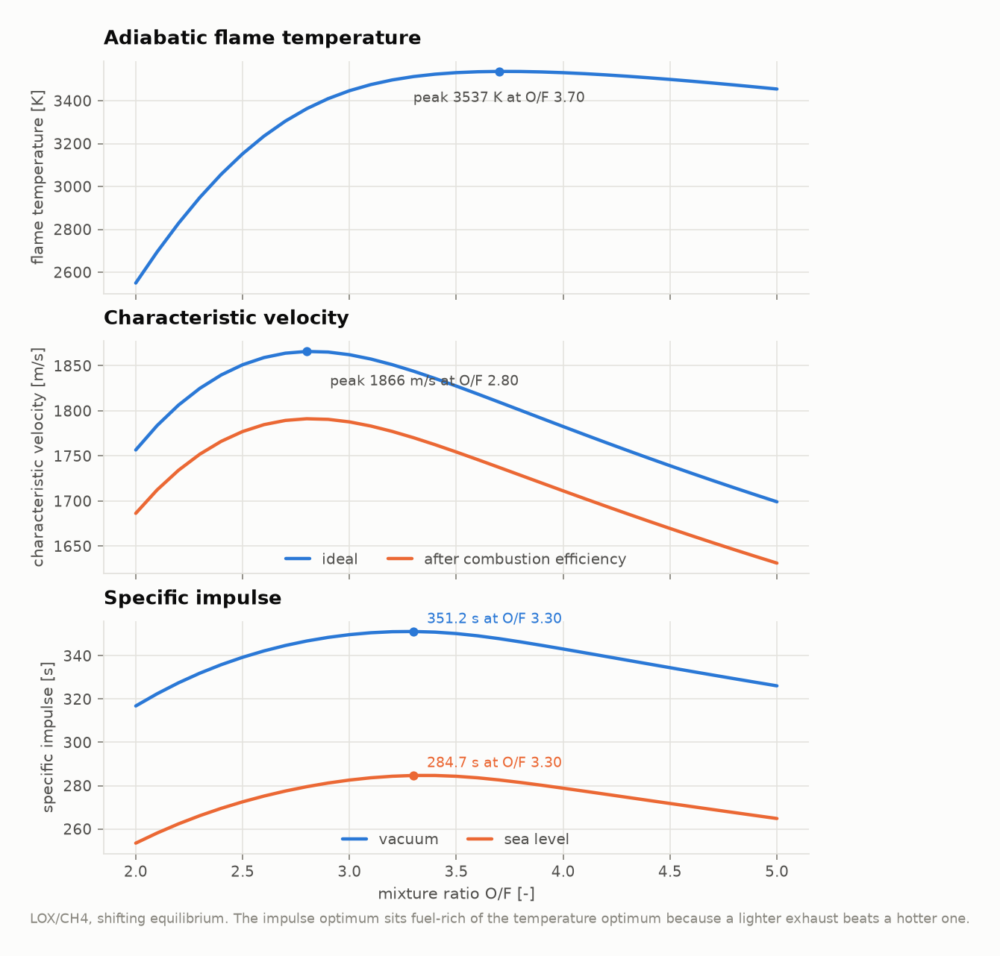 |
| Equilibrium composition against mixture ratio | Flame temperature peaks at O/F 3.70, c\* at 2.80, I<sub>sp</sub> at 3.30 |
| 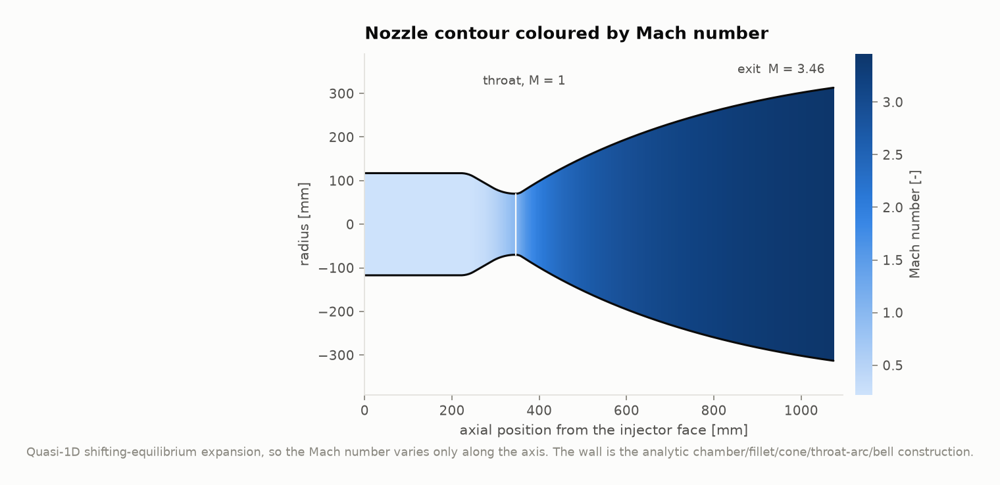 | 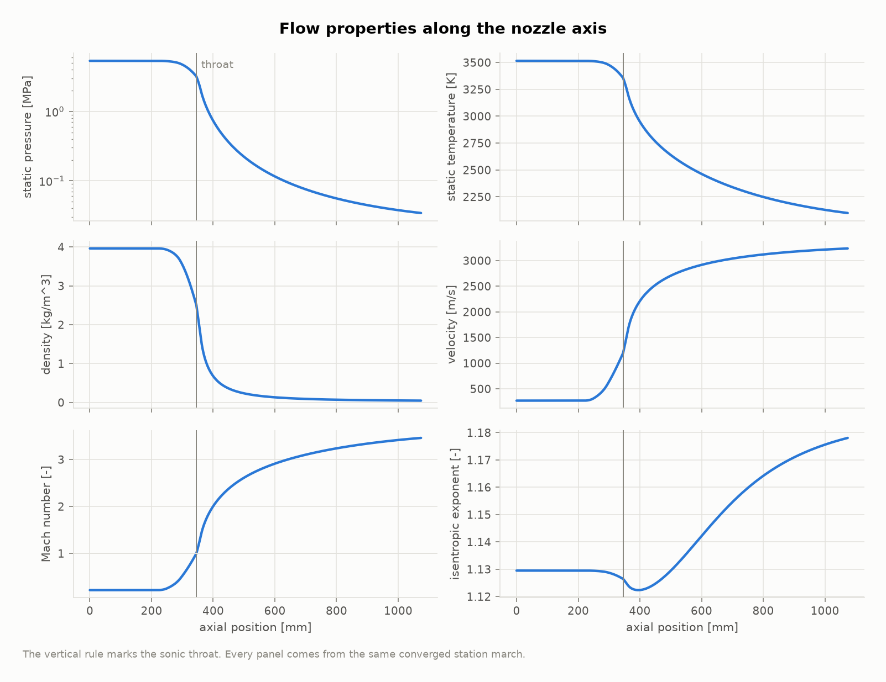 |
| The Ignis-M1 contour coloured by Mach number | p, T, ρ, u, M and γ<sub>s</sub> along the axis |
| 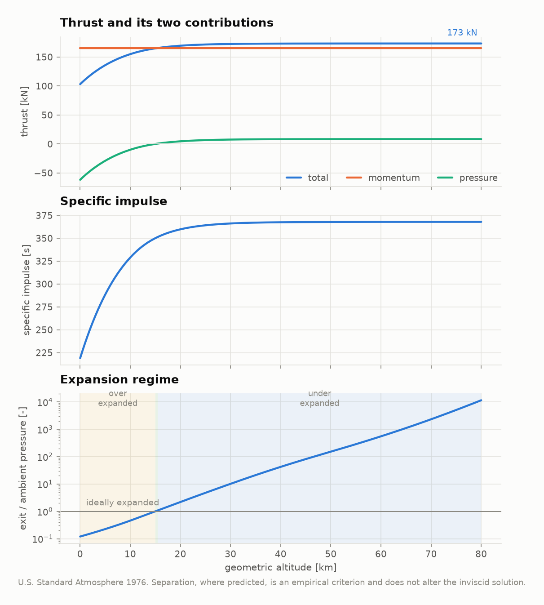 | 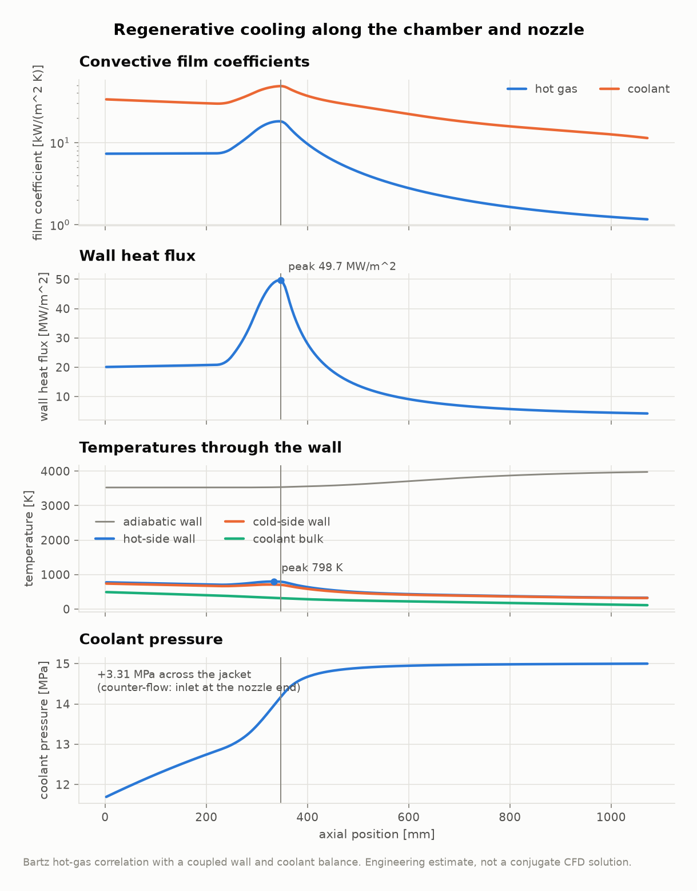 |
| Thrust split into momentum and pressure terms | Film coefficients, flux, wall temperatures, coolant pressure |
| 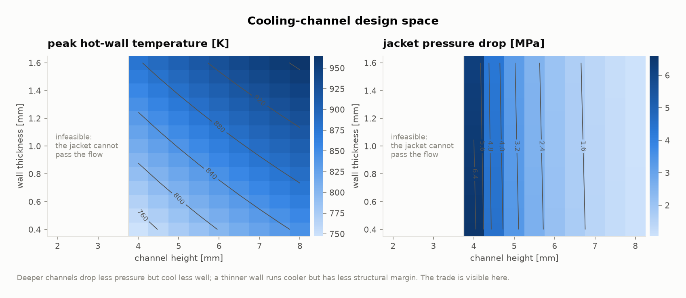 | 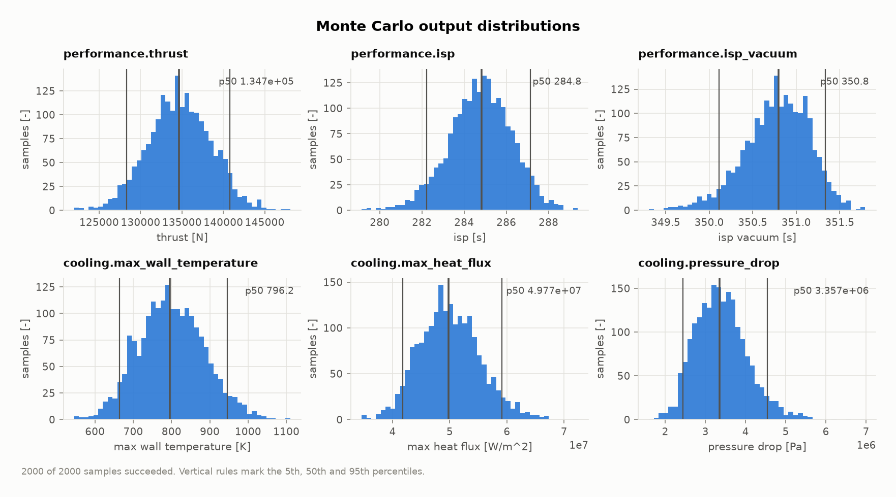 |
| Peak wall temperature and Δp over the channel design space | Output distributions with p5/p50/p95 |

All 16 figures live in `results/figures/` and are regenerated by
`python3 python/make_figures.py`.

---

## Validation

Measured, not asserted — reproduce with `./scripts/validate.sh`. Full detail in
[`docs/validation.md`](docs/validation.md).

### Against NASA CEA (through `rocketcea`, the actual NASA Glenn FORTRAN)

| | LOX/CH<sub>4</sub>, 84 cases | LOX/H<sub>2</sub>, 72 cases |
|---|---:|---:|
| Chamber temperature | **0.161 %** | **0.181 %** |
| Mean molar mass | 0.059 % | 0.076 % |
| γ<sub>s</sub> | 0.040 % | 0.047 % |
| Characteristic velocity | 0.051 % | 0.060 % |
| Vacuum I<sub>sp</sub> | 0.040 % | 0.047 % |

Frozen expansion, 84 cases: c\* 0.065 %, exit temperature 0.329 %, vacuum
I<sub>sp</sub> 0.077 %.

The residual difference is a **data** difference, not a solver difference:
Ignis uses the NASA TM-4513 (1993) 7-coefficient set, CEA 2002 the
9-coefficient set. Given identical data the two minimisers agree far more
closely:

### Against Cantera on identical data — 65 states

| Flame temperature | Molar mass | Frozen c<sub>p</sub> | Any mole fraction |
|---:|---:|---:|---:|
| **1.74e-10** | 1.40e-10 | 3.38e-11 | 3.36e-09 |

Species thermodynamics agree to **< 1e-11** over 441 species/temperature pairs.
Transport: mixture viscosity within 3.1 %, and within **0.16 %** for the actual
Ignis-M1 chamber mixture. USSA-1976 reproduces its published values exactly
(0.37338 Pa at 86 km).

### Balances that are reported, not assumed

Every solve recomputes how well it satisfied its own equations:

| | Ignis-M1 | Ignis-H1 |
|---|---:|---:|
| Element balance | 1.14e-14 | 3.17e-15 |
| Gibbs stationarity | 1.42e-14 | 7.11e-15 |
| Enthalpy closure | 7.36e-15 | 7.45e-15 |
| Nozzle mass flux | 2.13e-14 | 4.37e-14 |
| Nozzle stagnation enthalpy | 2.94e-16 | 4.52e-16 |
| Cooling energy balance | 1.75e-10 | 4.83e-09 |
| Cooling local flux consistency | 4.36e-10 | 3.02e-10 |

Start-up transient: mass conservation **5.71e-15**, energy **2.60e-13** over
0.8 s of physical time.

### Verification highlights

Full detail in [`docs/verification.md`](docs/verification.md).

* The quasi-1D solver reproduces the analytic constant-γ nozzle to **7.1e-12**
  in pressure across both branches, with mass and stagnation enthalpy exact.
* The transient integrator converges at **order 4.15 / 4.05 / 4.17** on a
  smooth problem; the adaptive and fixed-step integrators agree to 2.4e-7.
* Equilibrium from 12 random initial guesses lands on the same answer to 1e-8.
* Monte Carlo at 1, 4 and 7 threads gives **byte-identical** sample matrices.
* **78 test cases, 17,550 assertions, 0 failures** on GCC 13.3 and Clang 18.1,
  Release and Debug, with `-Wall -Wextra -Wpedantic -Werror`.
* The committed `results/` tree was **reproduced bit-for-bit** from a fresh
  clone: 9 reports and 33 CSV tables compared, and the only differences were
  measured wall times ([`verification.md` §6](docs/verification.md)).

---

## Performance

Intel Xeon @ 2.80 GHz, 4 threads, GCC 13.3.0 Release, Eigen 3.4.0. Full table
in [`docs/benchmarks.md`](docs/benchmarks.md).

| | |
|---|---:|
| Adiabatic equilibrium solve, 26 species | **0.058 ms** (24 Newton iterations) |
| Isentropic equilibrium solve | 0.140 ms |
| Chamber + throat + exit state | 7.99 ms |
| Complete analysis (400 stations + cooling + feed) | 263 ms |
| Equilibrium table build (51 701 solves) | 1.22 s |
| Adaptive transient, 0.8 s physical | 1.24 s (**53× faster** than fixed-step RK4) |
| Monte Carlo, 4 threads | **29.2 samples/s** (3.40× speed-up) |
| Clean build, 45 translation units, `-j4` | 36 s |
| Full reproduction (`run_all.sh`) from a fresh clone | 13 min 49 s |

The Newton system size is independent of species count; going from 8 to 26
species costs 4.4× (a measured exponent of 1.27), which is the O(N·E) assembly
of the system, not the linear solve.

---

## Architecture

```
include/ignis/ + src/          the library, 12 modules, no I/O in the physics
  core/         constants, unit conventions, exception hierarchy
  thermo/       NASA-7 polynomials, species database, mixtures, transport
  equilibrium/  constrained Gibbs minimisation and its derivative properties
  combustion/   propellants, mixture assembly, chamber state, c*
  nozzle/       contour generation, quasi-1D flow, shocks, atmosphere
  thermal/      Bartz, wall conduction, coolant EOS, regenerative jacket
  transient/    tabulated equilibrium EOS, 0-D chamber, RK4 / RK4(5)
  cycle/        injector, lines, valves, tank pressures, pump power
  engine/       SteadyEngine: one config in, one complete analysis out
  optimize/     named parameters, sweeps, augmented Lagrangian + Nelder-Mead
  uncertainty/  distributions, deterministic Monte Carlo, sensitivity
  io/           YAML config with path-qualified errors, JSON, CSV, CLI
apps/           the six executables -- parse, call, print
tests/          78 Catch2 cases: unit, verification, validation, integration
python/         ignis_viz (figures) and ignis_explorer (the desktop UI)
explorer.py     launcher for the Ignis Engine Explorer
configs/        12 shipped scenarios
data/           species, propellants, materials, coolant tables (all cited)
tools/          the generators that build data/ and validation/reference/
validation/     externally produced reference data (CEA, Cantera, CoolProp)
scripts/        build.sh  test.sh  validate.sh  run_all.sh
docs/           theory, architecture, configuration, V&V, benchmarks, limits
```

Every module depends only on the modules below it. The study layer runs the
**same** `SteadyEngine` code path as a single run — a test compares a sweep
point to a direct run bit-for-bit — so there is no faster approximate model
that could disagree with the real one.

[`docs/architecture.md`](docs/architecture.md) has the dependency diagram, the
data-flow diagram and the error policy.

---

## Documentation

| Document | Contents |
|---|---|
| [`docs/theory.md`](docs/theory.md) | The complete mathematical formulation, 17 sections, every correlation cited |
| [`docs/architecture.md`](docs/architecture.md) | Module layout, dependency graph, data flow, error policy, threading |
| [`docs/configuration.md`](docs/configuration.md) | Every configuration key, every named parameter and metric |
| [`docs/verification.md`](docs/verification.md) | Exact solutions, order of accuracy, conservation residuals, error paths |
| [`docs/validation.md`](docs/validation.md) | NASA CEA, Cantera and reference-EOS comparisons with measured errors |
| [`docs/benchmarks.md`](docs/benchmarks.md) | Measured timings, scaling and parallel efficiency |
| [`docs/limitations.md`](docs/limitations.md) | What the model cannot do, and what would have to change |
| [`docs/explorer.md`](docs/explorer.md) | The desktop Explorer: layout, charts, constraints, colour contract |
| [`docs/extending.md`](docs/extending.md) | How to add species, propellants, correlations, figures |

---

## Limitations

The short version — the full list is [`docs/limitations.md`](docs/limitations.md):

* **Ignis-M1 and Ignis-H1 are conceptual engines.** Nothing here has been
  compared with a test stand, and nothing here is flight-ready.
* **Gas-phase equilibrium only.** No condensed carbon, no finite-rate kinetics;
  the frozen and shifting limits bracket the truth but do not give it.
* **Quasi-1D, inviscid nozzle.** No boundary layer. Separation is *predicted*
  by an empirical criterion and flagged, but the inviscid solution is not
  modified — so a separated nozzle's reported thrust is optimistic.
* **The thermal model is an engineering estimate.** Bartz carries ±20–30 %
  scatter, and the Monte Carlo campaign disperses it explicitly rather than
  pretending otherwise. No axial conduction, no thermal stress, no life
  analysis.
* **η<sub>c\*</sub> is an assumed input, not a prediction.** There is no
  injector or mixing model. Ideal and corrected quantities are reported
  separately everywhere so the assumption stays visible.
* **The transient is valid from ignition onward.** It cannot represent the cold
  pre-ignition fill or ignition overpressure, and it says nothing at all about
  combustion stability.
* **No cycle balance.** The feed model sizes pressures; it does not close a
  gas-generator, staged-combustion or expander cycle.

Ignis is built so that where it is uncertain, it says so: failed solves throw
with actionable messages instead of being clamped into plausible-looking
numbers, every empirical correlation is labelled and carries an uncertainty
multiplier, and every balance is reported as a residual rather than assumed.

---

## Licence

MIT — see [`LICENSE`](LICENSE).

All shipped data is from published, openly available sources, cited in the file
that carries it: NASA TM-4513 and NASA RP-1311 (thermochemistry and propellant
enthalpies), GRI-Mech 3.0 (comparison fit), Setzmann & Wagner 1991, Leachman
*et al.* 2009 and Schmidt & Wagner 1985 (coolant equations of state, evaluated
with CoolProp), the U.S. Standard Atmosphere 1976, and the open literature for
the Bartz, Dittus–Boelter, Gnielinski, Colebrook, Summerfield and Schmucker
correlations. Reference data for validation was generated with NASA CEA (via
`rocketcea`), Cantera and CoolProp, all of which are free software.
