# Ignis

[](https://github.com/Nathan-W123/Ignis/actions/workflows/ci.yml)
[](LICENSE)


**A thermochemical liquid-rocket propulsion simulator in C++17.**

Ignis computes what a liquid rocket engine does, from the propellants up:
- equilibrium combustion composition and flame temperature, by constrained
  Gibbs minimisation;
- quasi-1D nozzle expansion with shifting, frozen or finite-rate chemistry,
  corrected for the wall boundary layer;
- thrust and specific impulse at any altitude;
- regenerative and film cooling, with an integral boundary layer on the
  hot-gas side;
- the turbopump power balance of gas-generator, staged-combustion and expander
  cycles;
- chamber start-up and shutdown transients;
- constrained design optimisation, and Monte Carlo uncertainty propagation
  with sensitivity ranking.

LOX/methane, LOX/hydrogen and LOX/RP-1 are all supported.

It is validated against **NASA CEA** and **Cantera**, agrees with CEA to
**0.18 % or better** on flame temperature and **0.06 % or better** on
characteristic velocity across 156 rocket cases, and reports the residual of
every balance it claims to close.

It is also checked against **measurements**, not just against other codes
([details](docs/validation.md)). Two experiments supply the gas-side heat
transfer: local heat flux in a heated-air nozzle at JPL (1965), and a
LOX/hydrogen heat-sink rocket fired at NASA Lewis the same year.
- **Bartz's correlation** over-predicts the air nozzle by about 45 % at high
  pressure and 150 % at low pressure, and the rocket's throat by 72 %.
- **Ignis's default, an integral turbulent boundary layer** marched from the
  injector face, lands on the high-pressure air data (median 1.00) and halves
  Bartz's shape error in the rocket. It is as wrong as Bartz where the layer
  laminarises, and says so.
- **The wall-film correlation** reproduces its own 1959 measurements to 4 %.
- **The pumps, turbines and preburners** reproduce the RS-25's published
  turbopump horsepower and preburner mixture ratios to 0.1–4.5 %.

Knowing a model's error, and its shape along the engine, is worth more than
assuming it away.

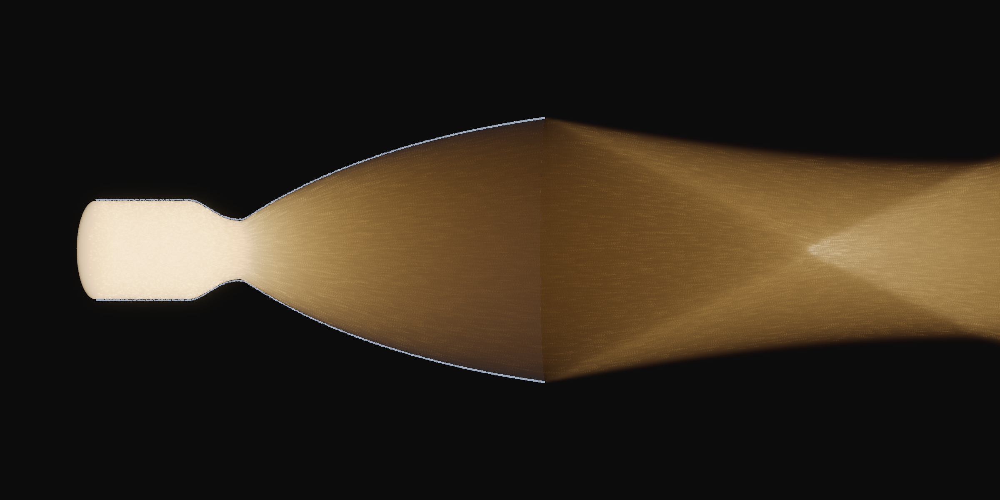

*The Ignis-M1 at 3 km: chamber, throat, bell and exhaust plume. Nothing here is
painted on — the hue at every point is Planck's law at the computed temperature
and the brightness is the computed density, integrated along the camera rays.
Ignis stops at the exit plane, so the plume is a separate axisymmetric Euler
solution started from the exit state; its lip shock stands at 25.19°, against
23.88° from exact oblique-shock theory. See
[how the renders are made](docs/rendering.md), and what the plume model leaves
out.*

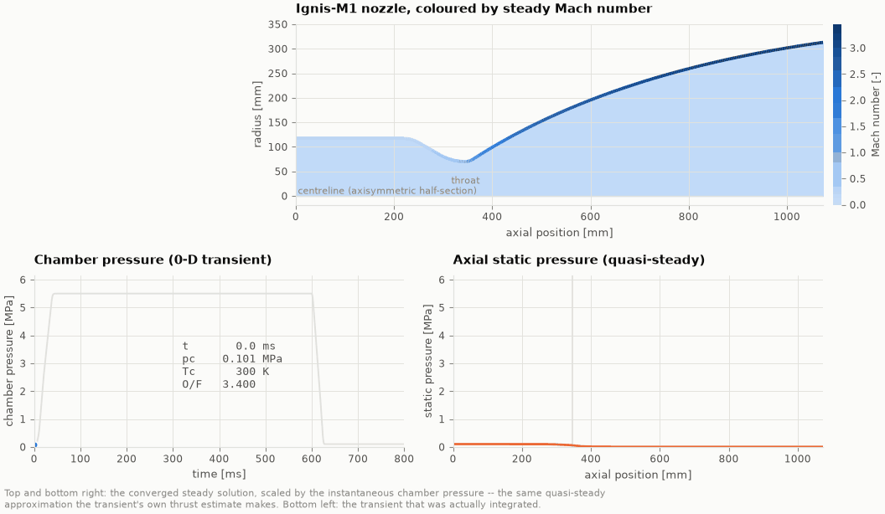

*The Ignis-M1 chamber pressure building through ignition, integrated with a
zero-dimensional mass and energy balance closed by a tabulated equilibrium
equation of state. The nozzle panel is the converged steady solution — see
[what that means](docs/limitations.md#5-transient).*

---

## Contents

| | |
|---|---|
| [What it does](#what-it-does) | The physics, module by module |
| [Quick start](#quick-start) | Build and run in three commands |
| [Results](#results) | Actual measured output |
| [Validation](#validation) | Against NASA CEA and Cantera |
| [Performance](#performance) | Measured benchmarks |
| [Architecture](#architecture) | How the code is laid out |
| [Documentation](#documentation) | The full set |
| [Limitations](#limitations) | What this is *not* |

---

## What it does

**Thermochemistry.** 40 species from NASA TM-4513 7-coefficient polynomials.
Chemical equilibrium by constrained Gibbs-energy minimisation in the
Gordon–McBride descent formulation, solved in (ln n<sub>j</sub>, ln n,
π<sub>i</sub>, ln T). The per-species unknowns are eliminated analytically, so
the Newton system is (E+1)×(E+1) at fixed temperature and (E+2)×(E+2) when the
temperature is unknown — **4×4 or 5×5 for a C/H/O system, regardless of how
many species are carried**. Constant-(T,p), constant-(h,p), constant-(s,p) and
constant-(u,v) problems, plus the full equilibrium derivative set
(c<sub>p,eff</sub>, ∂lnV/∂lnT, ∂lnV/∂lnp, γ<sub>s</sub>, sound speed).

**Combustion.** Propellants carry their *absolute* enthalpy in their delivered
state — liquid oxygen at 90.18 K, liquid methane at 111.66 K — so the chamber
solve is a genuine constant-enthalpy problem from the tank, not from gaseous
reactants at 298.15 K.

**Nozzle.** Rao-type bell contours from six analytic C¹ segments, or conical.
Quasi-1D marching on static pressure with shifting-equilibrium or frozen
chemistry; the throat located by M(p) = 1; area ratios by a safeguarded
Newton iteration on the exact slope of ρu along the isentrope. Finite-rate recombination through the divergent nozzle, the
one-dimensional-kinetics calculation of the JANNAF methodology. It uses the
H/O/CO reactions of GRI-Mech 3.0, takes reverse rates by detailed balance on
Ignis's own thermochemistry, and integrates with an L-stable linearly implicit
scheme. It matches Cantera's march on identical data to 10⁻⁸. The wall
boundary layer's discharge coefficient, displaced exit and momentum deficit
are applied to the thrust. Variable-property equilibrium-gas normal shocks (ideal thermal EOS,
state-dependent c<sub>p</sub>, γ and molar mass — not a non-ideal
compressibility model), expansion-regime classification, and the Summerfield
and Schmucker separation criteria. U.S. Standard Atmosphere 1976 with the
standard's own constants.

**Thermal.** Chapman–Enskog transport with Neufeld collision integrals, the
Brokaw polar correction, modified Eucken and Wilke mixing. The hot-gas
coefficient comes from an integral turbulent boundary layer, its momentum and
energy integrals marched from the injector face and coupled to the wall
temperature (Elliott, Bartz & Silver); Bartz's closed form is an option.
Recovery temperature, cylindrical wall conduction, optional gray-gas
radiation. Wall films from the injector (Hatch & Papell), channels that taper
along the axis. Regenerative cooling as a coupled hot-gas/wall/coolant balance
with rectangular-fin efficiency, an enthalpy-based coolant march, Colebrook
friction and reference-EOS coolant properties (Setzmann & Wagner, Leachman
*et al.*, Schmidt & Wagner, and n-dodecane as RP-1's surrogate).

**Cycles.** Pumps integrate dp/ρ along each propellant's real-fluid table.
Turbines expand generator or preburner gas at frozen composition, or an
expander's heated fuel along its table. Gas generators and preburners burn at
the mixture ratio their turbine temperature sets, with the pump work and
jacket heat in their propellants. Gas-generator, fuel- or oxidiser-rich
staged-combustion and expander balances close for a given chamber pressure,
or say how far short they fall. The fuel pump's discharge sets the cooling
jacket's inlet.

**Transient.** A zero-dimensional chamber tracking oxidiser and fuel mass
separately, closed by a pre-tabulated equilibrium equation of state with
tensor-product cubic-Hermite interpolation (measured error ≤ 0.13 %).
Fixed-step RK4 and adaptive Cash–Karp RK4(5). Mass and energy conservation
integrals reported on every run.

**Studies.** N-dimensional sweeps; constrained optimisation by augmented
Lagrangian around a dimension-adaptive Nelder–Mead simplex with Latin-hypercube
multi-start; Monte Carlo with per-sample `SplitMix64` seeding, so results are
**byte-identical regardless of thread count**, plus standardised regression
coefficients, Spearman rank correlations and local elasticities.

---

## Quick start

Needs a C++17 compiler, CMake ≥ 3.16, and Python 3 with NumPy, pandas and
Matplotlib for the figures. Eigen, yaml-cpp and Catch2 are used if installed
and fetched automatically if not.

```bash
git clone https://github.com/Nathan-W123/Ignis.git && cd Ignis
./scripts/build.sh                 # configure + build, ~1 min on 4 cores
./scripts/test.sh                  # 125 test cases, ~1.5 min on 4 cores
```

Run the nominal LOX/methane engine:

```bash
./build/bin/ignis_engine --config configs/methane_nominal.yaml
```

Reproduce **everything** in this README — every case, sweep, transient,
optimisation, Monte Carlo campaign, benchmark and figure:

```bash
pip install -r python/requirements.txt
./scripts/run_all.sh               # 14 min from a fresh clone; --quick for 6
```

It prints its own end-to-end wall time at the end, and it fails loudly on the
first error.

### The desktop Explorer


```bash
pip install -r python/requirements-explorer.txt
python3 explorer.py
```

**Ignis Engine Explorer** puts the solver behind an interactive dashboard:
change a chamber pressure, mixture ratio, expansion ratio or altitude and see
the performance, the flow field and the thermal consequence, with a second
design slot for side-by-side comparison. It implements no physics of its own —
it writes a configuration, runs the same binaries listed below, and shows what
they returned, including the refusal when a design does not close. The model's
limitations are pinned open next to the answer rather than hidden behind a
menu. See [`docs/explorer.md`](docs/explorer.md).

It opens on a real engine: the **RS-25**, the Space Shuttle Main Engine, solved
from Rocketdyne's published geometry and operating point and drawn inside
NASA's public-domain 3-D model of its nozzle. Ignis's numbers are set beside
Rocketdyne's: vacuum Isp 456.4 s against ≈ 452 s, and propellant flow +3.7 %.
The chamber heat load is 1.23 times what the published coolant temperatures
imply, down from 1.85 under Bartz's correlation. The drop came from the
integral boundary layer and the engine's published fuel film, not from
tuning. Where each number comes from, and what accounts for each gap, is in
[`data/engines/rs25/README.md`](data/engines/rs25/README.md). Without a
compiler the Explorer replays saved solves of its presets, so it runs from a
plain `pip install`.


Its **Flow** tab takes the exit state of whatever design is solved and marches
the axisymmetric Euler equations outward from it, starting from rest, and
draws it in 3-D on the GPU -- the axisymmetric solution swept around its axis
is the 3-D field, so this is the solution itself, not an extrusion of a slice.
You watch the plume establish itself: the jet front driving into still air, the
starting vortex, the shock cells forming from the exit plane outward and the
Mach disc settling. Every frame is a solution at that instant — nothing is
interpolated between frames and nothing is painted on — and the march can be
written straight out as an mp4. The plume model is inviscid and axisymmetric,
so it solves shock structure and wave propagation and does **not** model
turbulent breakup; that caveat is printed under the viewer, not buried here.

You can also give it a real engine. `nozzle: contour_file:` takes a wall
contour as `x,r` pairs in metres, and `tools/contour_from_stl.py` reduces a CAD
mesh to one:

```bash
python3 tools/contour_from_stl.py engine.stl --axis x --scale 0.001 -o contour.csv
```

Everything the analytic parameterisation declares is then measured from the
contour instead — throat, contraction and expansion ratio, L\*, the exit wall
angle that sets the divergence loss, and the throat curvature radius Bartz
needs. On the JPL test nozzle of [`validation.md` §5b](docs/validation.md),
that curvature fit recovers 1.854 in from nine published tap values against the
1.800 in the report states independently. What an import cannot give you is
hardware: a quasi-1D model is a wall radius, so manifolds, injector and channel
routing are discarded, and the flow passage is what remains.

### The six tools

| Tool | What it does |
|---|---|
| `ignis_equilibrium` | Equilibrium composition, properties and residuals; `--mr-sweep MIN:MAX:N` for composition against mixture ratio |
| `ignis_engine` | One complete steady analysis: chamber, nozzle, performance, cooling, feed system |
| `ignis_nozzle` | Nozzle performance across altitude or ambient pressure, with regime classification |
| `ignis_transient` | Start-up / shutdown integration with conservation residuals |
| `ignis_sweep` | Full-factorial sweeps and constrained optimisation (`--mode optimize`) |
| `ignis_mc` | Deterministic multithreaded Monte Carlo with sensitivity ranking |

All six take `--config`, `-o/--output`, `--prefix`, `--set KEY=VALUE`,
`--help`, `--version`, and return a non-zero exit status on any failure.

---

## Results

Three conceptual engines are carried through the whole repository. **They are
invented for this project and are not models of any real hardware.** Every
number below is from the committed `results/` tree, which `run_all.sh`
regenerates.

### Ignis-M1: LOX/methane booster, sea-level nozzle

`configs/methane_nominal.yaml` · p<sub>c</sub> 5.5 MPa · O/F 3.4 · R<sub>t</sub>
70 mm · ε 20 · η<sub>c\*</sub> 0.96 · 300 CuCrZr channels with the full fuel
flow and a 3 % fuel film · gas-generator cycle

| | |
|---|---:|
| Flame temperature | **3523.92 K** |
| Mean molar mass | 21.6169 g/mol |
| γ<sub>s</sub> (isentropic) | 1.12968 |
| Characteristic velocity, ideal / corrected | 1835.93 / 1762.49 m/s |
| Mass flow | 47.9728 kg/s (C<sub>d</sub> 0.99865) |
| Exit Mach / pressure | 3.4476 / 35.27 kPa |
| Thrust at sea level | **131.0 kN** |
| I<sub>sp</sub> at sea level | **278.52 s** |
| I<sub>sp</sub> in vacuum | 344.83 s |
| Thrust coefficient, ideal / corrected | 1.5930 / 1.5476 |
| Boundary-layer loss | 4.45 s of vacuum I<sub>sp</sub> (1.27 %) |
| Kinetic efficiency (finite-rate nozzle) | 0.99530 |
| Peak heat flux | **41.98 MW/m²** at x = 342.9 mm (throat 345.5 mm) |
| Peak hot-wall temperature | **692.3 K** at x = 70.2 mm (617 K at the throat) |
| Coolant rise / pressure drop | 111.66 → 389.54 K / 2.05 MPa |
| Gas generator | 2.90 % of the flow; delivered vacuum I<sub>sp</sub> 338.74 s (exhaust expanded) to 334.84 s (dumped) |

The nozzle is over-expanded at sea level. The pressure term is **−20.3 kN**,
and separation is predicted at A/A<sub>t</sub> = 17.6. Ignis says so; it does
not quietly report the attached-flow number as if it were the whole story.
The hottest wall is not at the throat but 70 mm from the injector face, where
the boundary layer is still thin and the film has mostly mixed away.

### Ignis-H1: LOX/hydrogen upper stage

`configs/hydrogen_nominal.yaml` · p<sub>c</sub> 5.5 MPa · O/F 5.5 ·
R<sub>t</sub> 60 mm · ε 60 · η<sub>c\*</sub> 0.97 · 240 channels · expander cycle

| | |
|---|---:|
| Flame temperature | **3382.77 K** |
| Mean molar mass | 12.6428 g/mol |
| Characteristic velocity, ideal | 2337.60 m/s |
| Mass flow | 27.3939 kg/s (C<sub>d</sub> 0.99858) |
| Vacuum thrust | **121.3 kN** |
| Vacuum I<sub>sp</sub> | **451.43 s** |
| Boundary-layer loss / kinetic efficiency | 6.01 s (1.31 %) / 0.99646 |
| Peak heat flux / wall temperature | 56.03 MW/m² / **762.6 K** (518 K at the throat) |
| Coolant rise / pressure drop | 31.93 → 215.27 K / 1.36 MPa |
| Expander | fuel pump 12.20 MPa; turbine PR 1.576, 1181 kW; best power ratio 1.39 |

Half the molar mass buys 107 s of vacuum impulse over the methane engine
(451.43 s at ε = 60 against 344.83 s at ε = 20, a comparison of the two
*designs*, not of the propellants at matched geometry). Hydrogen drives 1.33×
the peak heat flux, yet its wall runs about 100 K cooler at the throat. The
H1's hottest wall is at the injector face, where its boundary layer starts and
no film protects it. The cycle sets the jacket's inlet: the hydrogen leaves
the pump at 31.9 K and 12.2 MPa.

### Ignis-K1: LOX/RP-1 booster

`configs/kerosene_nominal.yaml` · p<sub>c</sub> 6.0 MPa · O/F 2.4 ·
R<sub>t</sub> 120 mm · ε 16 · η<sub>c\*</sub> 0.96 · tapered channels with a 5 %
fuel film · gas-generator cycle

| | |
|---|---:|
| Flame temperature | **3603.72 K** |
| Characteristic velocity, ideal | 1803.30 m/s |
| Mass flow | 156.591 kg/s |
| Thrust at sea level | **433.6 kN** |
| I<sub>sp</sub> at sea level / vacuum | **282.33 s** / 330.09 s |
| Boundary-layer loss / kinetic efficiency | 3.08 s (0.92 %) / 0.99794 |
| Peak heat flux / wall temperature | 37.61 MW/m² / 789.1 K |
| Coolant rise / pressure drop | 298.15 → 486.46 K / 8.49 MPa |
| Gas generator | 3.36 % of the flow; delivered vacuum I<sub>sp</sub> 322.76 to 319.02 s |

RP-1 is a poor coolant. The K1's jacket closes only with channels tapered to
1.9 mm at the throat and a 5 % film, and even then the coolant-side wall reaches
746 K, above the 728 K at which NASA measured RP-2 begin to deposit carbon.
Ignis warns that this jacket would coke; the example exists to show it.

### Frozen, finite-rate and shifting expansion

LOX/CH<sub>4</sub> at p<sub>c</sub> = 5.5 MPa, O/F 3.4, ε = 45: shifting
**370.41 s** against frozen **343.56 s**, so recombination in the nozzle is
worth up to **7.82 %** of vacuum impulse. How much of it a real nozzle gets is a
rate question. The finite-rate march answers it, starting from shifting
equilibrium just past the throat:

| Inviscid vacuum I<sub>sp</sub> | Frozen from the start | Finite rate | Shifting | Kinetic efficiency | Share recovered |
|---|---:|---:|---:|---:|---:|
| Ignis-M1 | 338.23 s | 351.79 s | 353.45 s | 0.99530 | 89.1 % |
| Ignis-H1 | 449.37 s | 459.35 s | 460.98 s | 0.99646 | 85.9 % |
| Ignis-K1 | 325.76 s | 335.96 s | 336.66 s | 0.99794 | 93.6 % |

The delivered thrust in the tables above carries the kinetic efficiency.

### Constrained ascent trade study

Maximising vacuum I<sub>sp</sub> under thermal limits alone is not a trade:
vacuum I<sub>sp</sub> rises monotonically with expansion ratio, so the
optimiser walks ε to whatever bound it is given and the answer *is* the bound.
A booster delivers its impulse across a trajectory, and a first stage spends
most of its burn low, where an over-expanded nozzle loses thrust and eventually
separates. The shipped study therefore maximises the **time-weighted ascent
specific impulse** under the constraints that actually size a booster. Each of
its 2500 evaluations is a complete M1 analysis with the boundary layer, film
and jacket; it leaves out the finite-rate march and the cycle to keep the
search affordable.

| | Baseline | Optimised | |
|---|---:|---:|---|
| **Ascent I<sub>sp</sub>** (objective) | 314.10 s | **332.92 s** | +6.0 % |
| Chamber pressure | 5.50 MPa | **11.00 MPa** | at its 11 MPa bound |
| Mixture ratio | 3.40 | 3.375 | |
| Expansion ratio | 20.0 | **24.83** | interior to [6, 40] |
| Throat radius | 70.0 mm | 50.2 mm | near its 50 mm floor |
| Sea-level thrust | 132.0 kN | 149.7 kN | ✓ 130–150 kN class (**active**) |
| Peak wall temperature | 630.5 K | 798.4 K | ✓ ≤ 800 K (**active**) |
| Jacket pressure drop | 1.22 MPa | 1.62 MPa | ✓ ≤ 4.0 MPa |
| Separation margin at lift-off | −5.3 % | +11.0 % | ✓ ≥ +2 % |
| Exit diameter | 626 mm | 500 mm | ✓ ≤ 700 mm |
| Engine length | 1074 mm | 909 mm | ✓ ≤ 1300 mm |

The story the numbers tell: held to a 130–150 kN sea-level thrust class, the
optimiser raises chamber pressure to its ceiling and shrinks the throat to stay
under the thrust limit, until the **liner** runs out of margin. It settles the
expansion ratio at 24.8, where the flow still runs full at lift-off and the
ascent-averaged impulse peaks. With the boundary layer and film, the jacket's
pressure drop is no longer what binds; the wall temperature, the thrust class
and the pressure ceiling are.

An ε scan at fixed pressure shows why the objective matters: ascent
I<sub>sp</sub> peaks near ε = 15 and the separation margin goes negative by
ε = 20, while vacuum I<sub>sp</sub> is still climbing at ε = 90.

It is a local method with Latin-hypercube multi-start, not a global proof, and
12 starts are needed to find a feasible set this narrow. See
[limitations](docs/limitations.md#6-optimisation-and-uncertainty).

### Monte Carlo: 2000 samples, 10 dispersed inputs

102.2 s at 19.6 samples/s on 4 threads, 0 failures. Each sample is an M1
analysis with the boundary layer, film and jacket, without the finite-rate
march or the cycle:

| Output | mean | p5 | p95 | σ/mean |
|---|---:|---:|---:|---:|
| Thrust | 132.37 kN | 126.06 | 138.41 | 2.9 % |
| I<sub>sp</sub> (sea level) | 280.25 s | 277.67 | 282.68 | 0.5 % |
| I<sub>sp</sub> (vacuum) | 346.34 s | 345.66 | 346.89 | 0.1 % |
| Flame temperature | 3523.4 K | 3514.0 | 3531.6 | 0.15 % |
| **Peak wall temperature** | **690.8 K** | 581.6 | **804.4** | **9.9 %** |
| Peak heat flux | 42.1 MW/m² | 34.4 | 50.6 | 11.9 % |
| Jacket pressure drop | 2.09 MPa | 1.48 | 2.87 | 20.4 % |

**The headline result is the asymmetry.** Performance is tight: vacuum
I<sub>sp</sub> varies by 0.1 %. The thermal answer is not: **118 of 2000
samples exceed the wall-temperature limit**, and the single dominant cause is
the hot-gas film coefficient's own uncertainty (SRC **0.992**, Spearman 0.993),
not any manufacturing tolerance. That is the honest state of a conceptual
regeneratively cooled engine: the performance is known, and the cooling margin
is a correlation away from being unknown.

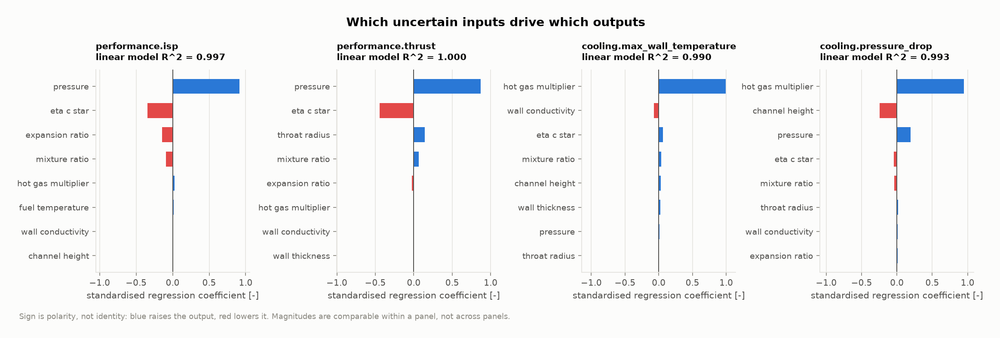

### More figures

| | |
|---|---|
| 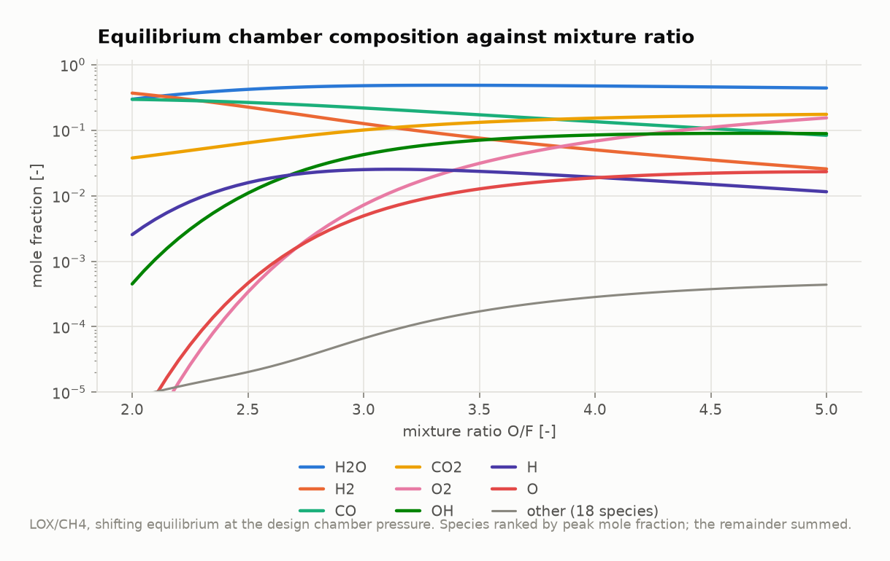 | 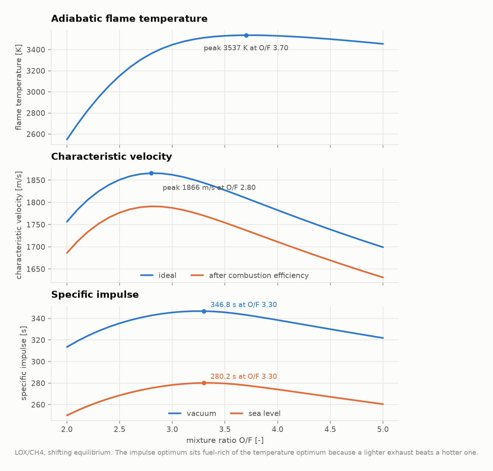 |
| Equilibrium composition against mixture ratio | Flame temperature peaks at O/F 3.70, c\* at 2.80, I<sub>sp</sub> at 3.30 |
| 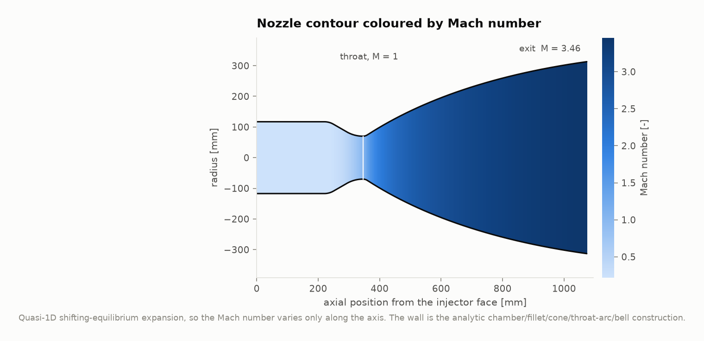 | 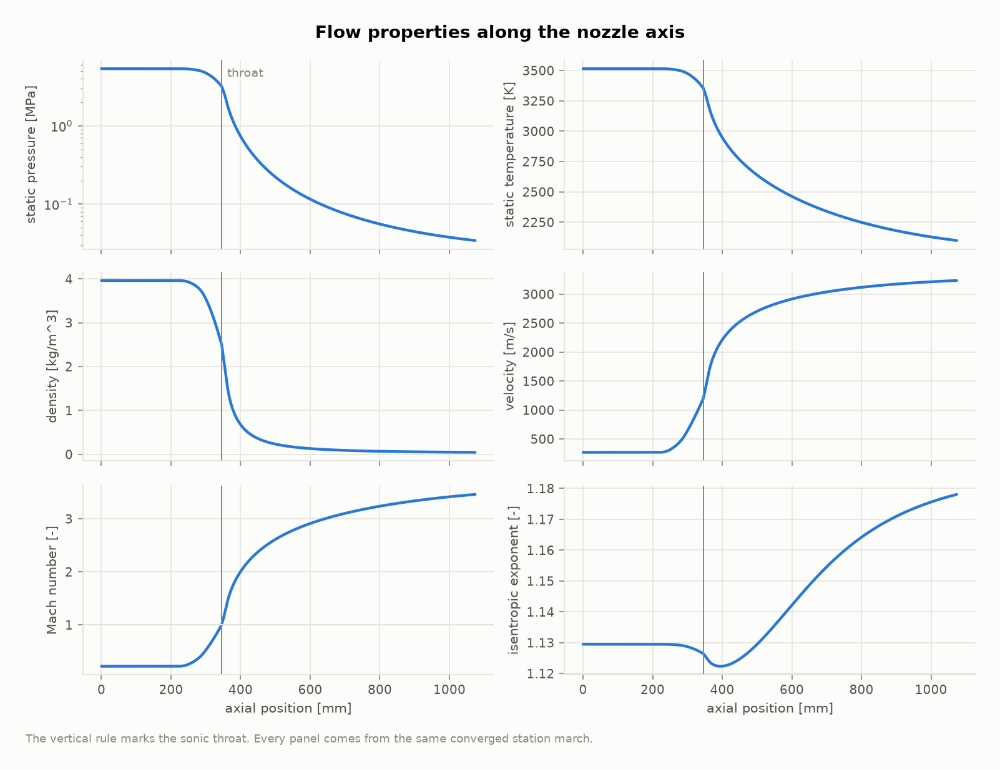 |
| The Ignis-M1 contour coloured by Mach number | p, T, ρ, u, M and γ<sub>s</sub> along the axis |
| 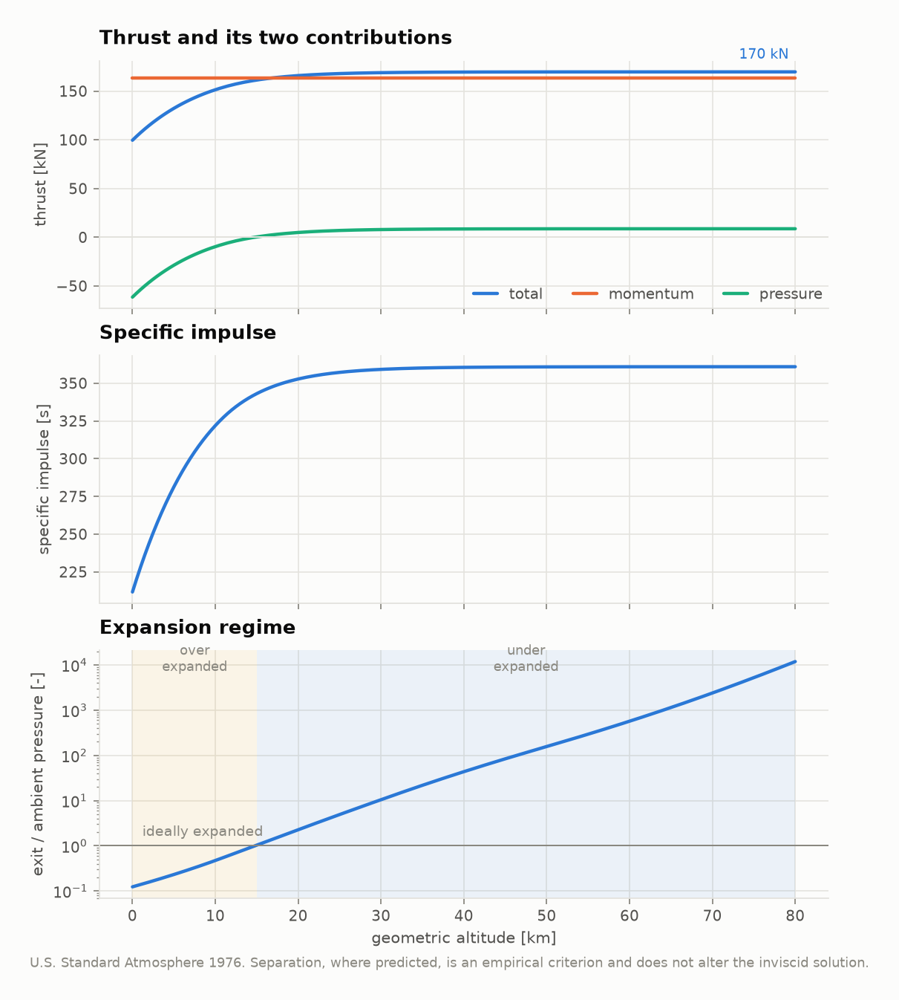 | 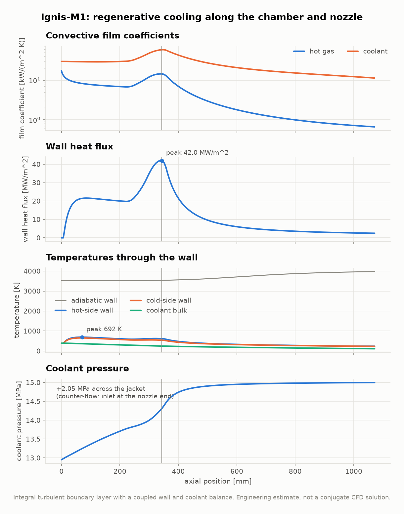 |
| Thrust split into momentum and pressure terms | Film coefficients, flux, wall temperatures, coolant pressure |
| 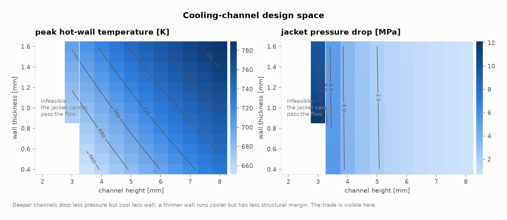 | 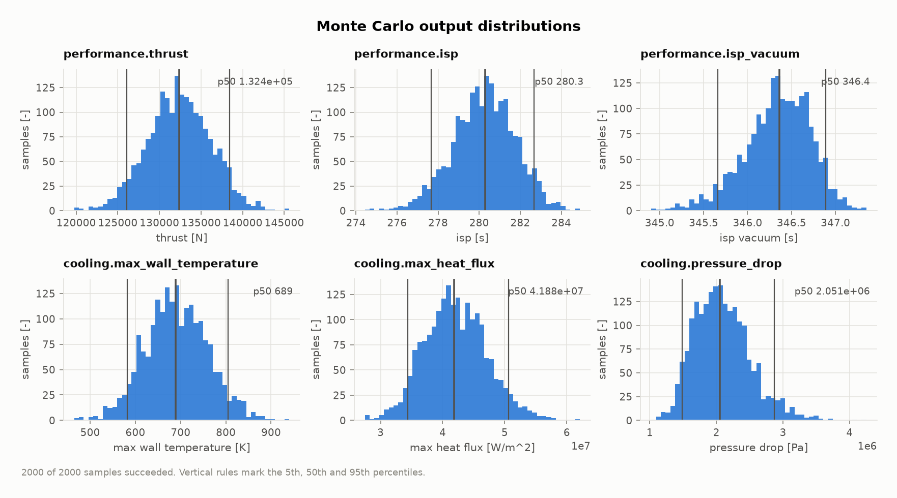 |
| Peak wall temperature and Δp over the channel design space | Output distributions with p5/p50/p95 |
| 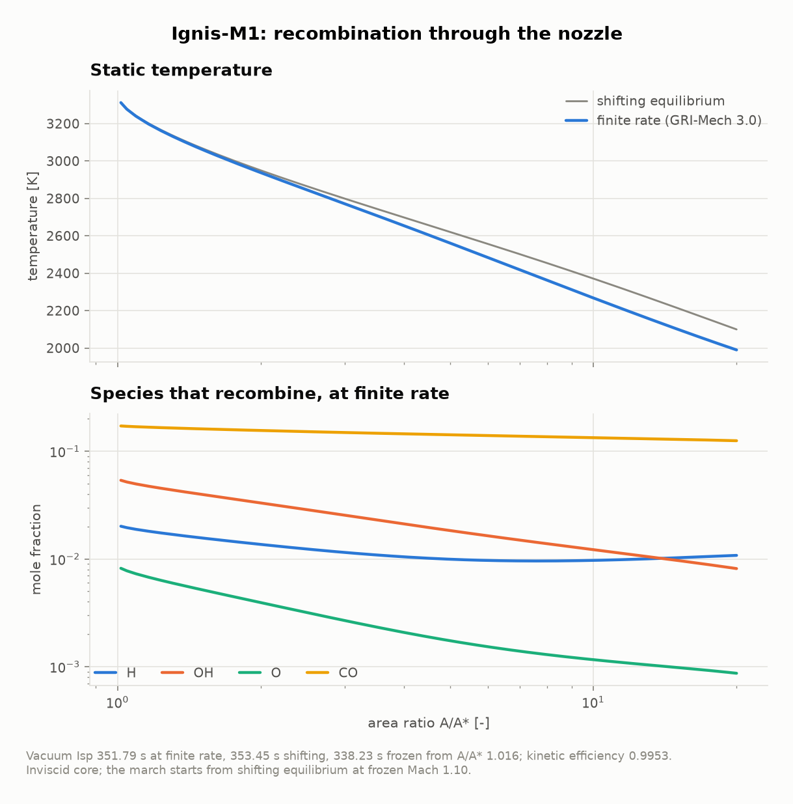 | 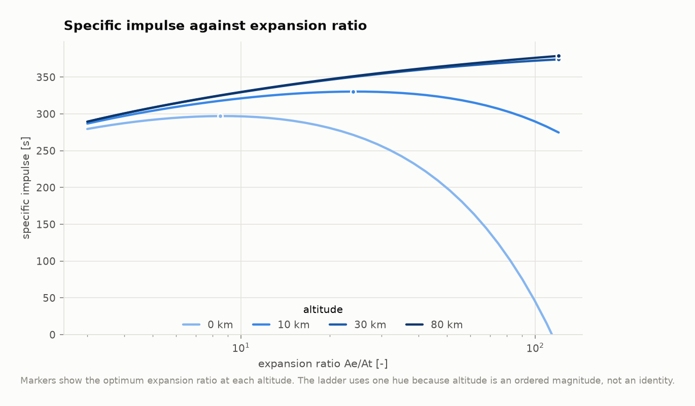 |
| Recombination at finite rate against shifting equilibrium | Sea-level and vacuum I<sub>sp</sub> against expansion ratio |

The 17 figures `python3 python/make_figures.py` draws (16 PNGs and the
start-up GIF) live in `results/figures/`. The volumetric renders, animations
and Explorer screenshots are separate: `python3 tools/make_cover.py`,
documented in [`docs/rendering.md`](docs/rendering.md).

---

## Validation

Measured, not asserted — reproduce with `./scripts/validate.sh`. Full detail in
[`docs/validation.md`](docs/validation.md).

### Against NASA CEA (through `rocketcea`, the actual NASA Glenn FORTRAN)

| | LOX/CH<sub>4</sub>, 84 cases | LOX/H<sub>2</sub>, 72 cases |
|---|---:|---:|
| Chamber temperature | **0.161 %** | **0.181 %** |
| Mean molar mass | 0.059 % | 0.076 % |
| γ<sub>s</sub> | 0.040 % | 0.047 % |
| Characteristic velocity | 0.051 % | 0.060 % |
| Vacuum I<sub>sp</sub> | 0.040 % | 0.047 % |

Frozen expansion, 84 cases: c\* 0.065 %, exit temperature 0.329 %, vacuum
I<sub>sp</sub> 0.077 %.

The residual difference is a **data** difference, not a solver difference:
Ignis uses the NASA TM-4513 (1993) 7-coefficient set, CEA 2002 the
9-coefficient set. Given identical data the two minimisers agree far more
closely:

### Against Cantera on identical data — 65 states

| Flame temperature | Molar mass | Frozen c<sub>p</sub> | Any mole fraction |
|---:|---:|---:|---:|
| **1.74e-10** | 1.40e-10 | 3.38e-11 | 3.36e-09 |

Species thermodynamics agree to **< 1e-11** over 441 species/temperature pairs.
Transport: mixture viscosity within 3.1 %, and within **0.16 %** for the actual
Ignis-M1 chamber mixture. USSA-1976 reproduces its published values exactly
(0.37338 Pa at 86 km).

### Balances that are reported, not assumed

Every solve recomputes how well it satisfied its own equations:

| | Ignis-M1 | Ignis-H1 |
|---|---:|---:|
| Element balance | 1.14e-14 | 3.17e-15 |
| Gibbs stationarity | 1.42e-14 | 7.11e-15 |
| Enthalpy closure | 7.36e-15 | 7.45e-15 |
| Nozzle mass flux | 2.43e-14 | 2.90e-12 |
| Nozzle stagnation enthalpy | 2.94e-16 | 2.26e-15 |
| Finite-rate march: energy / elements | 2.7e-15 / 2.5e-16 | 6.8e-15 / 1.4e-15 |
| Cooling energy balance | 7.41e-14 | 3.41e-13 |
| Cooling local flux consistency | 1.95e-09 | 2.82e-09 |
| Turbopump power balance | 2.59e-16 | 8.73e-13 |

Start-up transient: mass conservation **5.71e-15**, energy **2.60e-13** over
0.8 s of physical time.

### Verification highlights

Full detail in [`docs/verification.md`](docs/verification.md).

* The quasi-1D solver reproduces the analytic constant-γ nozzle to **1.8e-10**
  in pressure across both branches, with mass flux to 3.5e-12 and stagnation
  enthalpy to 1.5e-16.
* The transient integrator converges at **order 4.15 / 4.05 / 4.17** on a
  smooth problem; the adaptive and fixed-step integrators agree to 2.4e-7.
* Equilibrium from 12 random initial guesses lands on the same answer to 1e-8.
* Monte Carlo at 1, 4 and 7 threads gives **byte-identical** sample matrices,
  and `run_all.sh` checks the shipped campaign at 1 and 4 threads every time
  it regenerates the results.
* **125 test cases, 21,359 assertions, 0 failures** on GCC 13.3 and Clang 18.1
  in Release, with `-Wall -Wextra -Wpedantic -Werror`. The 121 cases not
  tagged `[slow]` also pass in a GCC Debug build.
* Every committed report names the build that produced it, by `git describe`
  of a clean tree ([`verification.md` §6](docs/verification.md)).

---

## Performance

Intel Xeon @ 2.80 GHz, 4 threads, GCC 13.3.0 Release, Eigen 3.4.0. Full table
in [`docs/benchmarks.md`](docs/benchmarks.md).

| | |
|---|---:|
| Adiabatic equilibrium solve, 26 species | **0.058 ms** (24 Newton iterations) |
| Isentropic equilibrium solve | 0.140 ms |
| Chamber + throat + exit state | 7.99 ms |
| Complete analysis (400 stations + cooling + feed) | 263 ms |
| Equilibrium table build (51 701 solves) | 1.22 s |
| Adaptive transient, 0.8 s physical | 1.24 s (**53× faster** than fixed-step RK4) |
| Monte Carlo, 4 threads | **29.2 samples/s** (3.40× speed-up) |
| Clean build, 45 translation units, `-j4` | 36 s |
| Full reproduction (`run_all.sh`) from a fresh clone | 13 min 49 s |

The Newton system size is independent of species count; going from 8 to 26
species costs 4.4× (a measured exponent of 1.27), which is the O(N·E) assembly
of the system, not the linear solve.

---

## Architecture

```
include/ignis/ + src/          the library, 13 modules, no I/O in the physics
  core/         constants, unit conventions, exception hierarchy
  thermo/       NASA-7 polynomials, species database, mixtures, transport
  equilibrium/  constrained Gibbs minimisation and its derivative properties
  combustion/   propellants, mixture assembly, chamber state, c*
  nozzle/       contour generation, quasi-1D flow, shocks, atmosphere
  thermal/      boundary layer, Bartz, film, wall conduction, coolant EOS, jacket
  kinetics/     reaction mechanism, finite-rate nozzle march
  transient/    tabulated equilibrium EOS, 0-D chamber, RK4 / RK4(5)
  cycle/        feed pressures, pumps, turbines, gas-generator / staged / expander
  engine/       SteadyEngine: one config in, one complete analysis out
  optimize/     named parameters, sweeps, augmented Lagrangian + Nelder-Mead
  uncertainty/  distributions, deterministic Monte Carlo, sensitivity
  io/           YAML config with path-qualified errors, JSON, CSV, CLI
apps/           the six executables -- parse, call, print
tests/          125 Catch2 cases: unit, verification, validation, integration
python/         ignis_viz (figures, renders) and ignis_explorer (the desktop UI)
explorer.py     launcher for the Ignis Engine Explorer
configs/        13 shipped scenarios
data/           species, propellants, materials, coolant tables, reaction
                mechanism (all cited)
tools/          the generators that build data/ and validation/reference/,
                contour_from_stl.py for importing CAD geometry,
                and make_cover.py, which renders the engine
validation/     externally produced reference data (CEA, Cantera, CoolProp,
                and three 1959-1965 experiments transcribed by hand)
scripts/        build.sh  test.sh  validate.sh  run_all.sh
docs/           theory, architecture, configuration, V&V, benchmarks, limits
```

Every module depends only on the modules below it. The study layer runs the
**same** `SteadyEngine` code path as a single run — a test compares a sweep
point to a direct run bit-for-bit — so there is no faster approximate model
that could disagree with the real one.

[`docs/architecture.md`](docs/architecture.md) has the dependency diagram, the
data-flow diagram and the error policy.

---

## Documentation

| Document | Contents |
|---|---|
| [`docs/theory.md`](docs/theory.md) | The complete mathematical formulation, 17 sections, every correlation cited |
| [`docs/architecture.md`](docs/architecture.md) | Module layout, dependency graph, data flow, error policy, threading |
| [`docs/configuration.md`](docs/configuration.md) | Every configuration key, every named parameter and metric |
| [`docs/verification.md`](docs/verification.md) | Exact solutions, order of accuracy, conservation residuals, error paths |
| [`docs/validation.md`](docs/validation.md) | NASA CEA, Cantera and reference-EOS comparisons with measured errors |
| [`docs/benchmarks.md`](docs/benchmarks.md) | Measured timings, scaling and parallel efficiency |
| [`docs/limitations.md`](docs/limitations.md) | What the model cannot do, and what would have to change |
| [`docs/explorer.md`](docs/explorer.md) | The desktop Explorer: layout, charts, constraints, colour contract |
| [`docs/rendering.md`](docs/rendering.md) | The volumetric renders, the Euler plume solver and what it omits |
| [`docs/extending.md`](docs/extending.md) | How to add species, propellants, correlations, figures |

---

## Limitations

The short version — the full list is [`docs/limitations.md`](docs/limitations.md):

* **Ignis-M1, Ignis-H1 and Ignis-K1 are conceptual engines.** Nothing here
  has been compared with a test stand, and nothing here is flight-ready. The
  RS-25 preset is a real engine's published operating point, used as a sanity
  check, not a validation.
* **Gas-phase chemistry.** No condensed carbon. Finite-rate chemistry covers
  recombination in the divergent nozzle only, with rates fitted to combustion
  experiments, not to nozzles.
* **A quasi-1D core with the boundary layer as corrections.** Separation is
  *predicted* by an empirical criterion and flagged, but the solution is not
  modified, so a separated nozzle's reported thrust is optimistic.
* **The thermal model is an engineering estimate.** The boundary layer
  matches high-pressure air data but not a laminarising layer, gets half the
  measured throat dip in a rocket, and can be off by up to a factor of two in
  an engine ([validation.md §5b](docs/validation.md)). The Monte Carlo campaign
  disperses it explicitly rather than pretending otherwise. No axial
  conduction, no thermal stress, no life analysis.
* **η<sub>c\*</sub> is an assumed input, not a prediction.** There is no
  injector or mixing model. Ideal and corrected quantities are reported
  separately everywhere so the assumption stays visible.
* **The transient is valid from ignition onward.** It cannot represent the cold
  pre-ignition fill or ignition overpressure, and it says nothing at all about
  combustion stability.
* **Cycle balances are verified, not validated.** Their components reproduce
  the RS-25's turbopump data; the closures have been checked for consistency
  only. Efficiencies are inputs, and there are no turbomachinery maps.

Ignis is built so that where it is uncertain, it says so: failed solves throw
with actionable messages instead of being clamped into plausible-looking
numbers, every empirical correlation is labelled and carries an uncertainty
multiplier, and every balance is reported as a residual rather than assumed.

---

## Licence

MIT — see [`LICENSE`](LICENSE).

All shipped data is from published, openly available sources, cited in the file
that carries it: NASA TM-4513 and NASA RP-1311 (thermochemistry and propellant
enthalpies), GRI-Mech 3.0 (reaction rates, and a comparison thermochemistry
fit), Setzmann & Wagner 1991, Leachman *et al.* 2009, Schmidt & Wagner 1985 and
Lemmon & Huber 2004 (coolant equations of state, evaluated with CoolProp), the
U.S. Standard Atmosphere 1976, the SSME Orientation manual (turbopump
validation), and the open literature for the Bartz, Hatch & Papell,
Dittus–Boelter, Gnielinski, Colebrook, Summerfield and Schmucker correlations. Reference data for validation was generated with NASA CEA (via
`rocketcea`), Cantera and CoolProp, all of which are free software.
