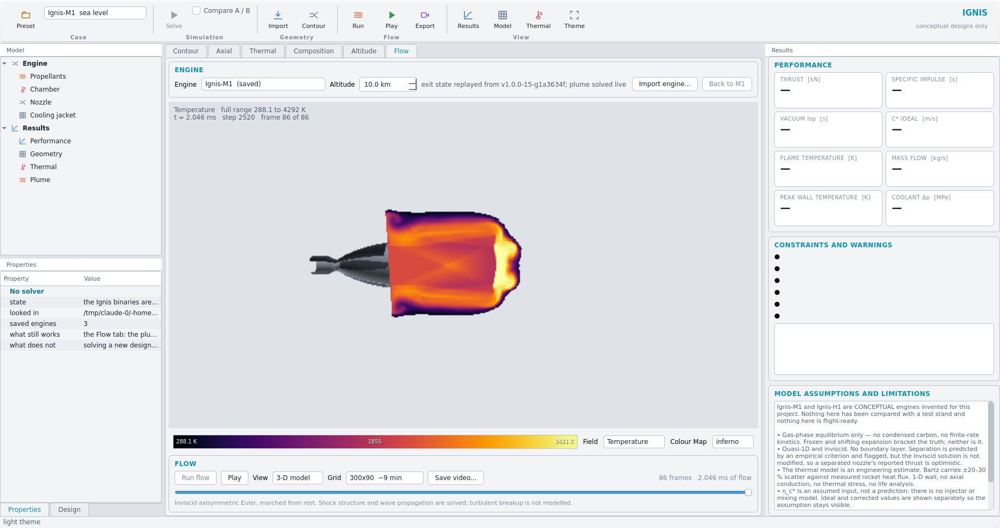
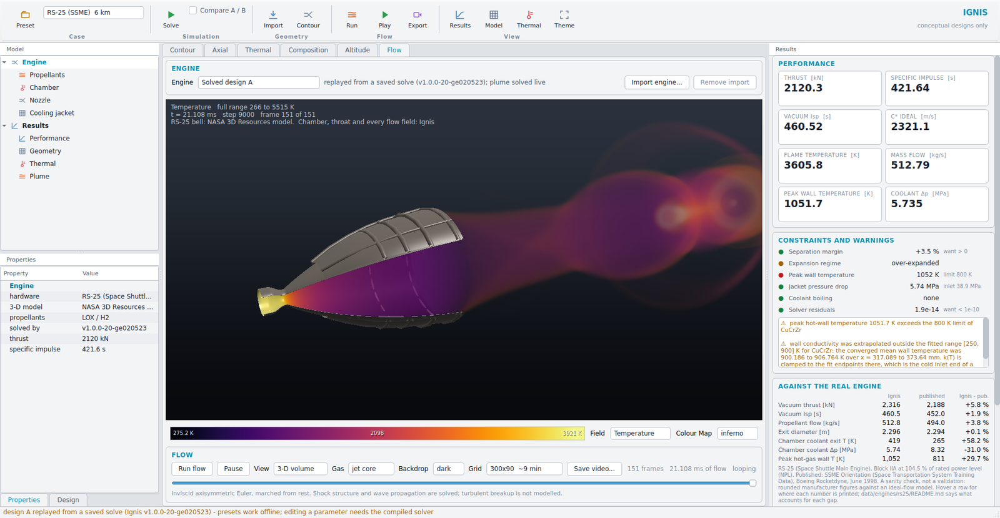

# Ignis Engine Explorer

A desktop front end for the Ignis solver. Change a chamber pressure, a mixture
ratio, an expansion ratio or an altitude and see what it does to thrust,
specific impulse, the wall temperature and the flow field — with the
constraints and the model's own limitations on screen next to the answer.



```bash
pip install -r python/requirements-explorer.txt
./scripts/build.sh          # the Explorer needs the Ignis binaries
python3 explorer.py
```

`IGNIS_BUILD_DIR=/path/to/build python3 explorer.py` points it at an existing
build.

---

## What it is, and what it is not

**The Explorer owns no physics.** It writes a configuration file, runs the same
`ignis_engine`, `ignis_equilibrium` and `ignis_nozzle` binaries the command
line drives, and reads back their JSON and CSV. A number on screen is a number
the solver produced. When the solver refuses a design — a jacket that cannot
pass the flow, an expansion past the property range — the Explorer shows the
refusal in red and leaves the charts on the last good state. It never fills the
gap with an estimate.

That also means the Explorer inherits every limitation in
[`limitations.md`](limitations.md), which is why a condensed version of that
document is pinned open in the right-hand column rather than hidden behind a
menu.

## Layout

| Column | Contents |
|---|---|
| Left | Design A and, when comparison is on, Design B: propellant, chamber pressure, mixture ratio, throat radius, expansion ratio, altitude, η<sub>c\*</sub>, frozen vs shifting expansion, and the jacket's channel height and wall thickness. |
| Centre | Five chart tabs — contour, axial profiles, wall and coolant, chamber composition, altitude sweep. |
| Right | Eight performance cards, the constraint and warning panel, and the assumptions panel. |

**Comparison.** Ticking *Compare A / B* opens a second design slot and overlays
both on every chart; the cards gain a Δ line showing A − B in absolute and
percentage terms, coloured green or amber according to which direction is
better for that quantity. The two slots keep fixed hues everywhere — cyan for
A, amber for B — so identity never moves when a chart is rescaled.

**Presets.** The RS-25 (below), Ignis-M1 at 10 km, at sea level and with the
vacuum nozzle, and the Ignis-H1 LOX/hydrogen upper stage. The Ignis presets
match the shipped configurations, so the Explorer and `scripts/run_all.sh` can
be checked against each other. Without the compiled binaries the Explorer
replays a saved solve of each preset (`data/results/`, written by
`tools/make_case_library.py` through the Explorer's own solver wrapper), and
says so in the status bar; any other design needs the binaries.

## The RS-25

The window opens on the RS-25 — the Space Shuttle Main Engine, Block IIA at
104.5 % of rated power — because it is a real engine with a real 3-D model and
published numbers to hold Ignis's against.

* **The physics** is Ignis's, from Rocketdyne's published inputs: throat area,
  contraction and expansion ratios, chamber and nozzle lengths, throat
  stagnation pressure, mixture ratio, combustion efficiency, coolant split
  and coolant inlet state. Three inputs the sources do not give are inferred
  and labelled as such.
* **The 3-D model** is NASA's model of the bell from its public 3-D Resources
  collection, shipped unmodified. It is drawn only while the solved geometry
  is the RS-25's; edit the throat or expansion ratio and it is replaced by the
  solved contour, because the hardware no longer describes the nozzle being
  solved. The chamber and throat, which NASA's model does not include, are
  drawn from the solved contour.
* **Against the real engine**, a panel in the results column, puts Ignis's
  vacuum thrust, vacuum Isp, propellant flow, exit diameter and chamber
  cooling beside Rocketdyne's figures whenever the design is that operating
  point. Hover a row for where the number is printed. It is a sanity check,
  not a validation, and the gaps are explained rather than tuned away.

Every source, every inferred input and every gap is in
[`data/engines/rs25/README.md`](../data/engines/rs25/README.md).

## The charts

* **Contour** — axisymmetric half-section, true to scale, the wall coloured by
  the local Mach number. Under comparison the two nozzles are stacked on a
  shared colour scale so the difference in size is read directly.
* **Axial** — static pressure (log), static temperature, velocity and Mach
  number along the axis, with the sonic throat marked.
* **Thermal** — wall heat flux, and the hot-side wall against the coolant bulk
  temperature, with the material limit drawn and named.
* **Composition** — chamber equilibrium mole fractions, ranked, on a log axis.
* **Altitude** — thrust and specific impulse from sea level to 80 km, with a
  shaded band where the Summerfield criterion predicts separation. The curve
  inside that band is optimistic, and the caption says so.

The altitude curve comes from `ignis_nozzle`, not from a Python atmosphere:
there is one implementation of the U.S. Standard Atmosphere in this repository
and it is the validated C++ one.

## Constraints panel

Six live checks, each with its value and the bound it is judged against:

| Check | Green when |
|---|---|
| Separation margin | the exit pressure is above the Summerfield separation pressure |
| Expansion regime | the nozzle is ideally expanded |
| Peak wall temperature | below 90 % of the material limit |
| Jacket pressure drop | below 35 % of the coolant inlet pressure |
| Coolant boiling | no sub-critical boiling detected |
| Solver residuals | element and mass-flow residuals below 1e-10 |

Below them, the solver's own warnings verbatim.

## Colour

Chart colour is assigned by the job it does, and the categorical palette was
validated against this theme's chart surface rather than chosen by eye — worst
adjacent colour-vision separation 14.1 (OKLab ΔE×100, 8 is the target), worst
adjacent normal-vision separation 16.2, every slot inside the dark lightness
band and above 3:1 contrast against the surface. Magnitude (Mach number) uses a
single-hue sequential ramp whose darkest step still clears the surface;
constraint state uses a reserved status palette that is never reused for a
series. No chart has a second y-axis.

## Performance

One design costs three solver invocations — the engine analysis, the
equilibrium export and the altitude sweep — and lands around 0.4 s on the
machine in [`benchmarks.md`](benchmarks.md). Solving runs on a worker thread,
so the window stays responsive, and the Run button re-enables when every
visible slot has finished. Changing a control marks the design stale in the
status bar rather than re-solving on every keystroke; Run, or Ctrl+Enter,
solves.


---

## The Flow tab



Every other tab shows a converged answer. This one shows the flow arriving.
It takes the exit state of design A, marches the axisymmetric Euler equations
outward from it starting from rest, and streams frames back while it runs, so
the plume can be watched building and scrubbed afterwards or written out as an
mp4.

What is on screen above is the RS-25 at 6 km, 21 ms after its plume started
flowing, in the 3-D volume view: NASA's model of the bell, cut away to show
the gas Ignis solved inside it, and the over-expanded jet necking into its
first shock diamond with the Mach disc glowing on the axis beyond it. The
chamber and throat are drawn from the contour Ignis solved, at the same scale
as everything else. The results column on the right sets Ignis's numbers for
the engine beside Rocketdyne's. The 2-D view shows the same march as a slice,
with every cell drawn.

The colour bar carries the ramp's limits and the caption the field's true
extremes. Those differ on purpose: the ramp spans the 1st to 99.5th
percentile over the whole march, because the starting shock leaves a handful
of cells far hotter than anything else in the run -- 5515 K in the RS-25 march
above, against a ramp that tops out at 3921 K -- and scaling to them would
leave the rest of the plume black from beginning to end. Printing both makes
the clipping visible instead of silent.

**The line under the viewer is the important one.** The plume model is
inviscid and axisymmetric. It solves shock structure and wave propagation;
it does not model turbulent breakup, which is three-dimensional and needs a
different code. The structures visible in the shear layer are real
Kelvin-Helmholtz rollup, which is an inviscid instability -- they are not a
turbulence model pretending to be one, and they are resolved only as far as
the grid allows.

The grid selector's times are how long the march takes to stop changing, not
how long before there is anything to see: frames begin arriving within a few
seconds. `Stop` keeps every frame captured so far.

### The 3-D volume view

The Flow tab opens on **3-D volume**: the engine as lit geometry with a wedge
cut out of it, and the flow drawn as a volume through and around it on the
GPU, at the window's full resolution. When a march finishes, playback loops on
its own -- the point is to watch the plume establish itself, again and again.

*Why a volume is not a different simulation.* The plume solution is
axisymmetric: it lives on (x, r), and the three-dimensional field is exactly
that field swept around the axis. A ray through the scene that samples a point
(x, y, z) reads the solution at (x, sqrt(y² + z²)) -- the real field at that
point in space, not an extrusion of a slice. Inside the engine the gas is drawn
from the quasi-1-D axial profile the solver produced, which is by definition
uniform across each station.

*What the brightness means.* Colour is the selected field through the
selected ramp, matching the colour bar. How much a stretch of ray contributes
follows the jet fraction the plume solver carries, through a smoothstep: air
is transparent, and so is the thin fringe the inviscid shear layer smears
across the domain -- mostly air with a trace of exhaust -- so the jet column
reads as a column. Hotter gas is made more opaque than cooler gas so the
shock cells on the axis are not hidden behind the jet's outer layers. That is
the standard emission-absorption picture a CFD post-processor draws for a
scalar field -- a visualisation choice, not a radiation calculation, and the
2-D view shows the same field with nothing hidden.

Two controls beside **View** change only the look. **Gas** picks which part
of the jet carries opacity: *jet core* (the default — gas at least 90 %
exhaust, so the shock cells show) or *whole jet* (the hot, slowed shear layer
around the core too; it is real, and drawn at full weight it hides the core).
**Backdrop** is *dark*, a studio gradient against which glowing gas reads as
glowing gas, or *light*, the theme's own surface, against which it reads as
smoke.

| Mouse | Action |
|---|---|
| Left drag | orbit |
| Right drag | pan along the axis |
| Wheel | zoom |

It needs OpenGL 3.3, which any GPU of the last decade and Mesa's software
renderer both provide, and PyOpenGL (in `requirements-explorer.txt`). When a
context cannot be had, the tab says why in its status line and falls back to
the CPU-drawn view rather than showing a black rectangle. **Save video** writes
whichever view is on screen.
